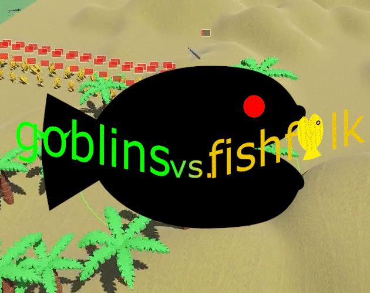

# Goblins vs. Fishfolk

A fan-game of [Pixeljunk's "Monsters 2"](https://store.steampowered.com/app/749800/PixelJunk_Monsters_2/).

My (our) first 3D game, powered by [godot 4](https://godotengine.org/download).

## Download the game from [itch.io](https://itch.io/games/genre-strategy/local-multiplayer/tag-3d/tag-tower-defense)

[Download Goblins vs. Fishfolk on Itch](https://renevanderark.itch.io/goblins-vs-fishfolk)

## A Word of Gratitude

Many thanks go out to my creative manager, son, and author of the musical scores: [Moon at bandlab](https://www.bandlab.com/moonlightgetsentient). Without him, there would have been no HP bars, no damage indicators shouting "Overkill", no sound and no music in this game.

Also my wife and colleagues who were so kind to playtest this game on different machines and platforms

## Short to Middle term Wishlist (Thanks to all the feedback)
- Add a settings menu to control audio for sfx and music
- Redesign the missile tower to be more in-theme: homing attack-pigeons from a bird-house would be radical.
- Make a great immersive [story mode](https://www.reddit.com/r/godot/comments/1e8ugca/comment/leasis1/)

## Future ideas...
- Short tutorial on making your own stage
- Short tutorial on contributing by forking
- Control a single tower via extra 3D viewport
- Create a high-scores server and a submit button
- Make camera look behind player more when zoomed in (only single player)
- add blunt (=area) and piercing damage types
- add elemental damage maybe?
- create a cute goblin village (model a small house, 3 of which makes a village)
- 3D cutscenes with more back story?

## Milestones in the creative process

### Milestone 24 - Vamping up the endless mode, playability
- [x] Add ocean to endless mode
- [x] Add turtle wave to endless mode
- [x] Add survival time to endless mode
- [x] Make gem and crystal drops deterministic
- [x] Add sprinting with the Y-button / Shift button (speeds up AnimationTree of goblin)
- [ ] Print survival time prominently on the game over splash (Well Done! You survived for N minutes and N seconds!)
- [ ] Add short explainers to each mode to the title screen
- [ ] Add leave game option to pause menu and using "select / -"
- [ ] Add a confirmation message 'Player N' has joined / left the game
- [ ] Add horizontally scrolling score cards to endless mode
- [ ] _team scores_: towers built (add thumbnails), upgrades bought per type per tower x crystal cost
- [ ] _team scores_: gems earned, crystals earned, gems spent, crystals spent
- [ ] _team scores_: damage dealt and kills per enemy type
- [ ] give endless mode the center stage

### [Milestone 23](https://github.com/Teaching-myself-Godot/fishfolk-vs-goblins/tree/milestone-23) - UI Audio, Main Menu fix [Improve my Game Jam feedback](https://itch.io/jam/imgj34/rate/2810521) (August 24th 2024)
- Write a new devlog with screen recording (about my first jam leading to many improvements)
- _sounds_: tower rising from ground
- _sounds_: tower sinking back into the ground
- _sounds_: confirm a build item from context menu / upgrade item
- _sounds_: spending gems
- Drop 3rd stage for now
- Improvement: Fix the obscure Main Menu / Title screen: just place the modes in 1 visible box (I will _never_ manage to make as many stages as Tikiman has beaten!)
- Add attributions in a new credits section: [JDSherbert](https://jdsherbert.itch.io/)
- ... and [Moon at bandlab](https://www.bandlab.com/moonlightgetsentient)
- ... and [photo](https://commons.wikimedia.org/wiki/Image:Chelonia_mydas_(green_sea_turtle)_(San_Salvador_Island,_Bahamas)_4_(16158070626).jpg?uselang=nl) by [photographer](https://www.flickr.com/people/47445767@N05) for turtle shell
- ... and another [photo](https://commons.wikimedia.org/wiki/File:Chelonia_mydas_176500422.jpg) for the flippers and head by [zygy](https://www.inaturalist.org/users/13405)

### [Milestone 22](https://github.com/Teaching-myself-Godot/fishfolk-vs-goblins/tree/milestone-22) - Gamepad tutorial / Integrated web build (August 22nd 2024)
- make gamepad svg's
- copy keyboard and mouse hints and turn into gamepad hints
- rebuild the web demo, optimize with simple overrides in separate files (not separate branch)
- add a start button for gamepad in web demo

### [Milestone 21](https://github.com/Teaching-myself-Godot/fishfolk-vs-goblins/tree/milestone-21) - Tutorial sequence feedback from [Improve my Game Jam feedback](https://itch.io/jam/imgj34/rate/2810521) (August 8th 2024)

- Improvement: drop the sequence about opening a pause menu with Esc
- Bugfix: spawn monsters after building 1st tower (fixes sequence)
- Improvement: drop the sequence which teaches you how to close menus by not giving you currency, give currency in advance
- add dismantle + refund hint

### [Milestone 20](https://github.com/Teaching-myself-Godot/fishfolk-vs-goblins/tree/milestone-20) - Be fair! [Improve my Game Jam feedback](https://itch.io/jam/imgj34/rate/2810521) (August 7th 2024)

- show path of next monster wave
- show a thumbnail label to indicate monster outside viewport
- make story stage possible

### [Milestone 19](https://github.com/Teaching-myself-Godot/fishfolk-vs-goblins/tree/milestone-19) - Better tutorial for Keyboard and Mouse (August 6th 2024)

- create 2D arrow scene
- use dynamically drawn arrows to point from things --> at things
- more details by using an indicator box with these arrow
- make keyboard and mouse SVG drawings
- explain controls visually with SVG drawings
- reorder README, Milestones new to old

### [Milestone 18](https://github.com/Teaching-myself-Godot/fishfolk-vs-goblins/tree/milestone-18) - Tower Context Menu II: upgrading towers (July 20th 2024)

- add damage upgrade option to tower menu
- add range upgrade option to tower menu
- add rate of fire upgrade option to tower menu
- add tower stats design in tower context menu
- show actual upgrade stats in tower context menu
- implement upgrade stats on tower
- increase prices in tower menu options per tower

### [Milestone 17](https://github.com/Teaching-myself-Godot/fishfolk-vs-goblins/tree/milestone-17) - Tower context menu I: dismantling towers (July 14th 2024)

- create context menu for towers
- add dismantle option to tower menu (costs 20 builder gems, no crystals)
- remember which trees were felled and regrow them

### [Milestone 16](https://github.com/Teaching-myself-Godot/fishfolk-vs-goblins/tree/milestone-16) - Release (July 14th 2024)

- Publish code by opening up the repo with MIT license
- Soft Launch to itch.io
- Make the promo-videos on Youtube listed
- Grab a little attention via socials (I use almost none so that'll do fine :D)

### [Milestone 15](https://github.com/Teaching-myself-Godot/fishfolk-vs-goblins/tree/milestone-15) - Winning the game, prepping soft launch (July 13th 2024)

- add stage music by: [くコ:彡Amna](https://www.bandlab.com/yoia_)
- show current wave progression
- Implement a MonsterWaveEmitter, which starts waves and reports which wave of how many just started
- Make win condition for stage (all waves passed)
- intro with back story
- tutorial stage for gamepad and keyboard+mouse
- Short screen recordings for promo and intro
- Windows installer (maybe test other platforms? - Linux worked)

### [Milestone 14](https://github.com/Teaching-myself-Godot/fishfolk-vs-goblins/tree/milestone-14) - Game over (June 12th 2024)

- with little baby goblins in cribs (model a crib with a cute baby in it, 20 of which make a nice target for the monsters to attack)
- make an attack animation when reaching the goal
- make the baby goblin and the attacking monster disappear in a cloud of dust
- Make lose condition -> all goblin babies gone
- Show gameover splash
- show a baby goblin counter

### [Milestone 13](https://github.com/Teaching-myself-Godot/fishfolk-vs-goblins/tree/milestone-13) - UI controls (June 12th 2024)

- fix game joining / keep better track of controllers input in one singleton
- make all menus use controls, so when paused no buggy stuff
- add an (optional) goblin spawn pos to the stage
- add cooldown times for confirm and pause actions for button overloading
- hide mouse cursor when middle mouse button is held
- give the game over spash screen a working delay

### [Milestone 12](https://github.com/Teaching-myself-Godot/fishfolk-vs-goblins/tree/milestone-12) - Stage select (June 2nd 2024)

- Make a main game scene which handles the title screen and menus
- Extract 2 reusable stage scenes
- Make a StageHolder to hold the current stage
- Make it possible to switch between stages (select in title screen)
- Use a stage in the StageHolder as a nice background for the title screen
- Add a title screen, which detects controller device via start button
- Add some MonsterSpawners with a couple of infinite waves to both scenes

### [Milestone 11](https://github.com/Teaching-myself-Godot/fishfolk-vs-goblins/tree/milestone-11) - Surfing (June 1st 2024)

- Make goblin piggyback on turtle
- Add surfing animation for goblin
- Make goblin surf on flying fish

### [Milestone 10](https://github.com/Teaching-myself-Godot/fishfolk-vs-goblins/tree/milestone-10) - Editable stages (June 1st 2024)

- Add MonsterPath scene with anchors that auto-generates a Curve3D to follow
- Add a MonsterTargetZone area that despawns monsters for now
- Add Spawner with MonsterPath and Timed Wave scenes
- Add Wave scenes with child PackedScene resource as monster type to be released using timer
- Create a second stage which can be run with the `debug.gd` script
- create true level terrain, with water for the fish-folk to crawl out of

### [Milestone 9](https://github.com/Teaching-myself-Godot/fishfolk-vs-goblins/tree/milestone-9) - Giant turtle (May 20th 2024)

- create a turtle model
- use a [photo](https://commons.wikimedia.org/wiki/Image:Chelonia_mydas_(green_sea_turtle)_(San_Salvador_Island,_Bahamas)_4_(16158070626).jpg?uselang=nl) by [photographer](https://www.flickr.com/people/47445767@N05) as texture
- and another [photo](https://commons.wikimedia.org/wiki/File:Chelonia_mydas_176500422.jpg) for the flippers and head by [zygy](https://www.inaturalist.org/users/13405)
- animate the model, dragging over the sand
- use tattooed-shader for dragging coloration on terrain
- use dust to hide flipper-clipping

### [Milestone 8](https://github.com/Teaching-myself-Godot/fishfolk-vs-goblins/tree/milestone-8) - Capitalism (May 16th 2024)

- model out builder gems
- make monsters drop currency
- model out magic crystals
- keep track of currency (start with 300 builder gems)
- more readable [font for numbers](https://www.fontspace.com/alpha-prota-font-f83519)
- make towers cost currency in context menu
- in a nice [price tag icon](https://svgsilh.com/image/151102.html)

### [Milestone 7](https://github.com/Teaching-myself-Godot/fishfolk-vs-goblins/tree/milestone-7) - Flying fish, Anti-Air (May 13th 2024)

- model aerial defense tower
- shoot some sort of projectile(s)
- cannot shoot grounded monsters
- cannon will not target flying monsters
- model flying fish
- create flying route for flying fish

### [Milestone 6](https://github.com/Teaching-myself-Godot/fishfolk-vs-goblins/tree/milestone-6) - Monster-life, Monster-afterlife (May 10th 2024)

- allow the monsters to die when HP runs out
- make monster model react to being hit
- make monster model react to dying (spinning around 3 axes, flying through the air like the little fish chibi's they are)
- give the monsters HP bars
- flying damage numbers

### [Milestone 5](https://github.com/Teaching-myself-Godot/fishfolk-vs-goblins/tree/milestone-5) - Cannon tower (May 9th 2024)

- add cannon tower to the Tree context menu options for Ground
- make a cannon tower model
- write `_point_at` code in `cannon_tower.gd`
- write `_shoot` code
- use a different range when highlighting (5 metres)
- make a cannonball sphere
- use a radius to deal impact damage scaled by distance from epicenter of impact
- animate the lighted fuse with particles
- cannonball  [smoke](https://www.youtube.com/watch?v=jVdgmbn67G8) particles
- use particles to animate the explosion
- use a shader to show impact tattooed on the terrain

### [Milestone 4](https://github.com/Teaching-myself-Godot/fishfolk-vs-goblins/tree/milestone-4) - Monsters (May 5th 2024)

- make a monster model
- make arrow towers point at the closest monster within range
- animate the monster
- make an arrow model
- align the arrow model to the shaft of the arrow tower model
- let the monster walk along a path
- make the arrow towers shoot arrows at the closest monster within range with the speed of the released bow string
- spawn in a new arrow aligned with the shaft and the tightening bowstring

### [Milestone 3](https://github.com/Teaching-myself-Godot/fishfolk-vs-goblins/tree/milestone-3) - Convert a tree into an arrow-tower (May 3rd 2024)

- [Show the range of the tower while selecting](https://godotshaders.com/shader/sdf-range-rings-3d/)
- make the tower rise out of the ground when built
- fell all the trees within the radius of the tower
- point the tower at something (a goblin)
- animate the tower shooting (bow string)
- point the tower at the first something within range (a goblin)
- show the range of the tower and highlight the tower when hugging the tower
- make both towers and trees huggable
- goblin can only hug 1 thing at at time

### [Milestone 2](https://github.com/Teaching-myself-Godot/fishfolk-vs-goblins/tree/milestone-2) - interactive tree(s) (April 30th 2024)

- [Highlight closest tree with outline mesh](https://www.reddit.com/r/godot/comments/16ulxqs/does_anybody_knows_how_this_3d_model_outline_is/)
- [Coloration of terrain close to tree](https://www.reddit.com/r/godot/comments/gok070/need_help_getting_world_coordinates_in_shader/)
- Open menu on B
- Use menu with L

### [Milestone 1](https://github.com/Teaching-myself-Godot/fishfolk-vs-goblins/tree/milestone-1) - multiplayer goblins (April 25th 2024)

- [DeltaBlock font CC0](https://www.fontspace.com/delta-block-font-f108775)
- [Youtube tutorial: Godot 4 / Blender - Third Person Character From Scratch](https://youtu.be/VasHZZyPpYU?si=uVCYltNUYqa3C8hG)
- [timescale in AnimationTree](https://github.com/godotengine/godot-proposals/issues/463#issuecomment-585551999)
- goblin model and scene, can run and jump
- 1-5 players, 1 keyboard, up to 4 controllers

### Milestone 0 - the inception (April 20th 2024)

- We were playing Monsters 2 a lot on the switch
- We loved the local multiplayer co-op
- I wanted to make a 2D tower defense game
- The family thought the tree-mechanic was cool
- ...that only works well in 3D
